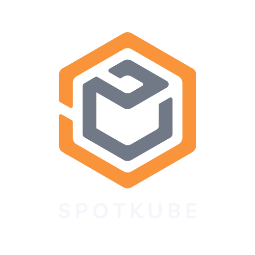
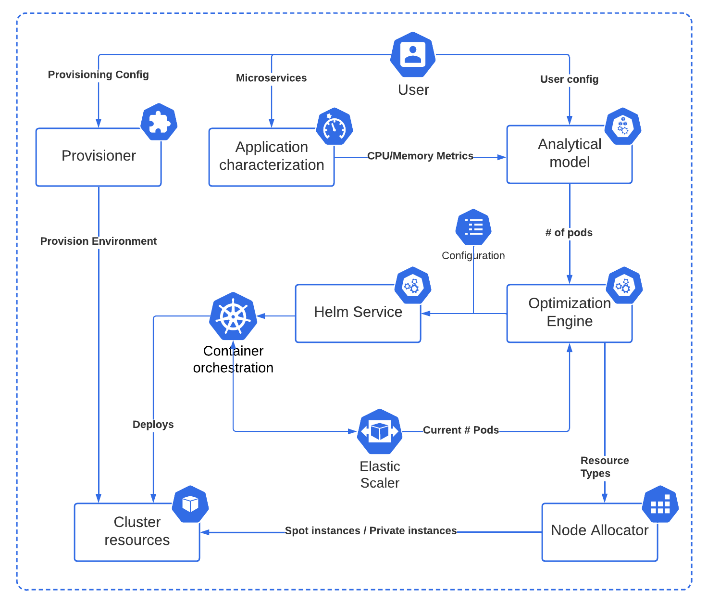

# SpotKube

<!--  -->

---

  

## Table of Contents

- [Introduction](#introduction)
- [Prerequisite](#prerequisite)
- [Architecture](#high-level-architecture)
- [Getting Stated](#usage)
- [Contributing](#contributing)
- [License](#license)
- [Contact](#contact)

## Introduction

SpotKube is an open-source Kubernetes-managed service that optimizes the deployment cost of microservices applications by autoscaling the Kubernetes cluster in a more intelligent way. The system is designed to deploy microservice-based applications on hybrid clouds, utilizing various components such as application characterization, analytical model, provisioner, optimization engine, node allocator, helm service, container orchestration tool Kubernetes, and elastic scaler.

## Pre-requisite

<!-------------------------------------------------- Architecture  --------------------------------------------------->
## Architecture

### High Level Architecture

  

## High-Level Architecture

The high-level architecture of SpotKube is designed to optimize the deployment cost of microservices applications on hybrid clouds. It consists of several components working together to achieve efficient autoscaling and deployment.

### Application Characterization

Characterize your application and provide CPU and memory metrics to the analytical model.

### Analytical Model

The analytical model analyzes the data provided by the application characterization and determines the optimal pod count for deploying the microservices application without violating user-defined SLOs (Service Level Objectives).

### Provisioner

The provisioner is responsible for building the necessary environment in both public and private cloud environments. It sets up the infrastructure required for deploying the microservices application and running various services.

### Optimization Engine

The optimization engine utilizes predictive modeling and real-time data to identify the optimal configurations for deploying microservices applications on hybrid clouds. It aims to achieve cost-effectiveness by considering factors such as resource utilization, workload patterns, and cost models.

### Node Allocator

The node allocator is responsible for allocating and configuring the nodes in the cluster. It adds new nodes to the cluster as needed based on the workload demands and scales down the cluster when resources are underutilized.

### Helm Service

The helm service is responsible for deploying the microservices application on the Kubernetes cluster. It handles the scheduling and management of the application's containers.

### Elastic Scaler

The elastic scaler dynamically monitors the system's configuration and notifies the optimization engine about the current state. This enables the optimization engine to adjust the system's configuration in real-time, ensuring optimal resource utilization and cost-efficiency.

The components of SpotKube work together to optimize the deployment of microservices applications on hybrid clouds, providing scalability, cost-effectiveness, and efficient resource utilization.

For further information, refer to the [architecture documentation](documentation/design.md).

[Back to Table of Contents](#table-of-contents)

<!-------------------------------------------------- Usage  --------------------------------------------------->
## Usage

To start optimizing the deployment of your microservices applications on hybrid clouds using SpotKube, follow these steps:

For more detailed instructions on how to use SpotKube, please refer to the [user guide](documentation/user_guide.md).

[Back to Table of Contents](#table-of-contents)

<!-------------------------------------------------- Contributing  --------------------------------------------------->
## Contributing

We welcome contributions from the community! To contribute to SpotKube, please follow these steps:

1. Fork the SpotKube repository.
2. Create a new branch for your contribution.
3. Make your changes and submit a pull request.
4. We will review your changes and merge them if they meet our standards.

For more detailed instructions on how to contribute to SpotKube, please refer to the [contributing guide](https://github.com/SpotKube/SpotKube).

[Back to Table of Contents](#table-of-contents)

<!-------------------------------------------------- License  --------------------------------------------------->
## License

SpotKube is released under the Apache 2.0 license. For more information, please refer to the [license file](https://github.com/SpotKube/SpotKube/blob/dev/LICENSE).

[Back to Table of Contents](#table-of-contents)

<!-------------------------------------------------- Contact  --------------------------------------------------->

## Contact

If you have any questions or comments about SpotKube, please contact us or open an issue on [GitHub Issues](https://github.com/SpotKube/SpotKube/issues?q=is%3Aissue+is%3Aopen+sort%3Aupdated-desc).

[Back to Table of Contents](#table-of-contents)

