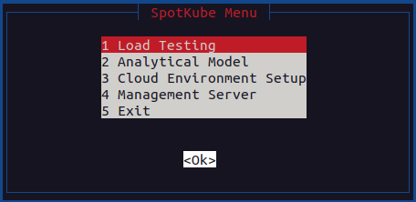
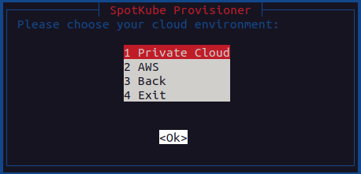
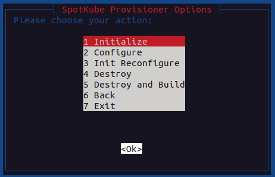
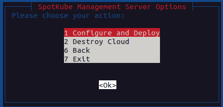

# SpotKube CLI
This section describes the SpotKube CLI and its usage. SpotKube CLI provides a command-line interface to interact with 
the SpotKube system. It is used to do the load testing, calculate the optimal replica count, setup the environment, and 
run management server services.

## Running the CLI
The SpotKube CLI is a bash script that can be run from the command line. The CLI can be run from the root directory.

### Main Menu
The main menu is the entry point to the CLI. It provides the following options:

  

### 1. Load Testing

This option is used to run the load test.

- It will ask for following inputs:
  - Name of the service to run Locust for
  - Root directory of the service
  - Host URL
  - Number of users to spawn
  - Spawn rate
  - Running time

### 2. Analytical Model

This option is used to calculate the optimal replica count for each service.

### 3. Setup Environment

This option is used to setup the environment for the SpotKube system.
After selecting this option, the CLI will ask for you to choose the cloud environment to setup. 

  

These options are available after you select the cloud environment:

  

| Option                 | Description                                             |
| ---------------------- | ------------------------------------------------------- |
| 1. Initialize          | Initializes the environment                             |
| 2. Configure Only      | Configures the  cloud environment (No provisioning)     |
| 3. Init Reconfigure    | Reconfigures the initialized environment                |
| 4. Destroy             | Destroys the cloud environment                   |
| 5. Destroy and Build   | Destroys and rebuilds the cloud environment      |
| 6. Back                | Returns to the main menu                                |
| 7. Exit                | Exits the CLI    

### 3. Management Server

This option is used to run the management server services.
These options are available after you select the cloud environment:

  

| Option                      | Description                                                                            |
| --------------------------- | -------------------------------------------------------------------------------------- |
| 1. Configure and Deploy     | Allocates the nodes to the cluster, configures them, and deploys microservices on the cluster. |
| 2. Destroy Cloud            | Destroys the nodes that are allocated. The management server and infrastructure won't be deleted. |
| 6. Back                     | Returns to the main menu.                                                              |
| 7. Exit                     | Exits the CLI.                                                                         |

[Back to Main Readme](../README.md)