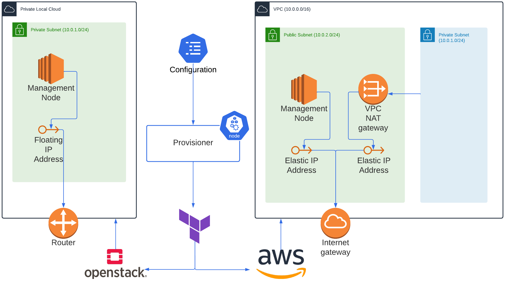

# Provisioner Component

The Provisioner component is a critical part of the system that creates the necessary environment in both public and private cloud environments. This environment is used to deploy microservice applications and run various services such as the optimization engine, node allocator, and helm service.

<!--  -->


- **VPC** - A virtual private cloud (VPC) is utilized to create a private cloud computing environment within the public cloud. This VPC provides a secure and isolated network environment for deploying microservices, ensuring the confidentiality and integrity of our applications. \bigskip

- **VPC NAT gateway** - Within the VPC, a NAT gateway service is employed to enable instances in a private subnet to connect to the internet. Traffic is routed from the NAT gateway to the internet gateway, and an Elastic IP is associated with the NAT gateway. This allows the instances to communicate with the internet using the IP address of the NAT gateway, providing secure outbound internet access for our microservice applications \cite{NATgatew24:online}. \bigskip

- **Internet gateway** - An internet gateway is used to enable resources in the public subnet to connect to the internet. This allows for communication between the management node, application, and the internet as needed \cite{Connectt63:online}. \bigskip

- **Management node** -  The management node is assigned an Elastic IP to make it accessible from the internet. Spotkube services, such as the optimization engine, node allocator, and helm service, run on this management node, providing the necessary functionalities for managing and optimizing the microservice application deployment process. \bigskip

- **Master node** - The master node is responsible for cluster management and provides the API that is used to configure and manage resources within the Kubernetes cluster. This ensures efficient management of microservices and their resources within the deployed environment. \bigskip

## Usage
To use the Provisioner component, you need to create a provisioner.conf file in the project root directory. This file contains configuration information for both private and public cloud environments. Here is a sample `provisioner.conf` file:

```
# Private Cloud Configuration
PRIVATE_INSTANCE_SSH_KEY_PATH='/home/user/.ssh/id_spotkube'
PRIVATE_INSTANCE_USER=username
PRIVATE_HOST_IP=10.0.0.0
PRIVATE_HOST_USER=username
PRIVATE_HOST_SSH_KEY_PATH='/home/user/.ssh/id_spotkube'
OPENSTACK_CLOUD_YAML_PATH='/home/user/.config/openstack/clouds.yaml'

# Public Cloud Configuration
AWS_SHARED_CONFIG_FILE_PATH='/home/user/.aws/config'
AWS_SHARED_CREDENTIALS_FILE_PATH='/home/user/.aws/credentials'
```

To use the Provisioner, fill in the appropriate information for your private and public cloud configurations. You can find the necessary information in your cloud provider's documentation. Once you have filled in the configuration information, save the file and place it in the `.config` folder in the project root directory.

## Configuration
The `provisioner.conf` file contains the following configuration options:

- `PRIVATE_INSTANCE_SSH_KEY_PATH`: The path to the SSH key used to authenticate with private cloud instances.
- `PRIVATE_INSTANCE_USER`: The username used to authenticate with private cloud instances.
- `PRIVATE_HOST_IP`: The IP address of the private cloud instance that will be used as the management node.
- `PRIVATE_HOST_USER`: The username used to authenticate with the private cloud host machine.
- `PRIVATE_HOST_SSH_KEY_PATH`: The path to the SSH key used to authenticate with the private cloud host machine.
- `OPENSTACK_CLOUD_YAML_PATH`: The path to the OpenStack cloud configuration file. This file contains authentication information for connecting to OpenStack clouds.
- `AWS_SHARED_CONFIG_FILE_PATH`: The path to the AWS configuration file. This file contains configuration information for connecting to AWS services.
- `AWS_SHARED_CREDENTIALS_FILE_PATH`: The path to the AWS credentials file. This file contains credentials for authenticating with AWS services.

## Dependencies

The Provisioner component has the following dependencies:

- Terraform: Provisioner uses Terraform to provision the necessary resources in the cloud environment.
- Ansible: Ansible is used to configure the instances that are provisioned by Terraform.


